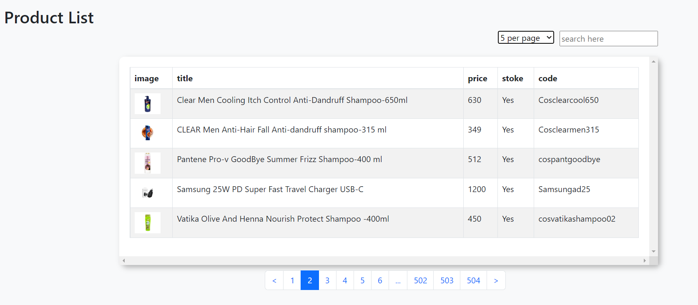

<h1>Business Table</h1>

<ul>
    <li>Install dependencies for back end</li>
</ul>

```
opne the "back-end" repository with VS Code
npm install
```
<ul>
    <li>Run  the back end</li>
</ul>

```
node index
```
<ul>
    <li>Install dependencies for front end</li>
</ul>

```
opne the "front-end" repository with VS Code
npm install
```
<ul>
    <li>Run  the front end</li>
</ul>

```
npm start
```


<h2>This is a table that contain product with details.</h2>
<h2>Features:</h2>
<p>1. dynamic pagination </p>
<p>2. Search Product </p>
<p>3. Increase table row </p>




